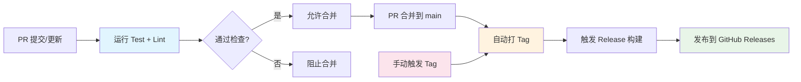

# ooc-server (Out-of-Container Server)

容器远程命令执行系统 - 让容器内的 AI agent 能够在宿主机上执行编译、测试等命令。

## 问题背景

在容器化开发环境中，AI agent 可以读写挂载的代码目录，但无法直接在宿主机上执行命令（编译、测试等）。当前需要手动退出容器执行命令，打断自动化流程。

本工具提供一个 server-client 系统：
- **Server** 运行在宿主机上，接收命令请求，执行并返回结果
- **Client** 在容器内运行，提供 CLI 接口供 agent 调用

## 特性

### 安全性
- ✅ API Token 认证（crypto/rand 生成，constant-time 比较）
- ✅ 白名单控制（字面匹配 + 正则匹配）
- ✅ 工作目录限制（防止路径跳转攻击）
- ✅ Shell 元字符检测（防止命令注入）
- ✅ 审计日志（JSONL 格式，自动轮转）

### 性能与可靠性
- ✅ 并发控制（最大 5 个并发执行）
- ✅ 超时控制（30 秒硬编码超时）
- ✅ 输出大小限制（10MB，防止内存耗尽）
- ✅ 进程组清理（超时后 kill 整个进程组）
- ✅ 配置热重载（5 秒检查间隔，RWMutex 保护）

### 易用性
- ✅ 单二进制文件部署（Go 静态编译）
- ✅ 配置文件外部化（支持 `ooc-server init` 生成）
- ✅ 兼容老系统（支持 CentOS 7 / glibc 2.17+）

## 快速开始

### 1. 安装

从 [GitHub Releases](https://github.com/user/out-of-container/releases) 下载对应平台的二进制文件：

```bash
# Linux x86_64
curl -L -o ooc-server https://github.com/user/out-of-container/releases/latest/download/ooc-server-linux-amd64
chmod +x ooc-server

curl -L -o ooc-client https://github.com/user/out-of-container/releases/latest/download/ooc-client-linux-amd64
chmod +x ooc-client
```

### 2. 初始化配置

```bash
# 在宿主机上生成配置文件
./ooc-server --init

# 输出示例：
# Config file created: /home/user/.config/ooc-server/config.yaml
# API Token: a1b2c3d4e5f6...
#
# Please edit the config file to customize:
#   - literal_commands: Add your allowed commands
#   - allowed_paths: Set your project directories
```

### 3. 配置白名单

编辑 `~/.config/ooc-server/config.yaml`：

```yaml
whitelist:
  literal_commands:
    - "make"
    - "cmake"
    - "g++"
    - "gcc"
    - "python3"
    - "pytest"

  allowed_paths:
    - "/home/user/projects"
    - "/tmp/build"
```

### 4. 启动 Server

```bash
./ooc-server --config ~/.config/ooc-server/config.yaml

# 输出：
# Server starting on 0.0.0.0:8080
```

### 5. 配置 Client

在容器内创建配置文件 `~/.config/ooc-client/config.yaml`：

```yaml
server_url: "http://<宿主机IP>:8080"
api_token: "a1b2c3d4e5f6..."  # 从 server 配置复制
timeout_seconds: 35
```

### 6. 执行命令

```bash
# 基本用法 - 执行无参数命令
./ooc-client -command make -cwd /home/user/projects

# 带参数 - 使用 JSON 数组格式（推荐）
./ooc-client -command g++ -args '["-std=c++17","main.cpp"]' -cwd /home/user/projects

# 使用配置文件中的 server URL 和 token
./ooc-client -command pytest -cwd /home/user/projects

# 覆盖配置
./ooc-client -server http://localhost:8080 -token your-token -command echo -cwd /tmp

# 列出服务器允许的命令
./ooc-client -server http://localhost:8080 -token your-token -list-commands

# 列出服务器允许的路径
./ooc-client -server http://localhost:8080 -token your-token -list-paths

# 查看帮助
./ooc-client -help
```

## 配置说明

### Server 配置

配置文件路径：`~/.config/ooc-server/config.yaml`

```yaml
server:
  listen: "0.0.0.0:8080"        # 监听地址
  timeout_seconds: 30             # 命令执行超时（秒）
  max_output_mb: 10               # 输出大小限制（MB）
  max_concurrent: 5               # 最大并发执行数
  api_token: "..."                # API Token（由 init 命令生成）

whitelist:
  literal_commands:               # 字面匹配（完全匹配命令名）
    - "make"
    - "g++"

  regex_commands:                 # 正则匹配（注意转义）
    - "^pip\\s+install"

  allowed_paths:                  # 允许的工作目录
    - "/home/user/projects"

  reload_interval_seconds: 5      # 配置热重载间隔

audit:
  enabled: true                   # 启用审计日志
  log_file: "~/.local/share/ooc-server/audit.log"
  rotation_max_mb: 10             # 单个日志文件最大大小
  rotation_count: 10              # 保留的日志文件数量
```

### Client 配置

配置文件路径：`~/.config/ooc-client/config.yaml`

```yaml
server_url: "http://localhost:8080"
api_token: "your-api-token-here"
timeout_seconds: 35               # 比 server 略大，避免网络延迟误判
```

## 安全性说明

### 威胁模型

**假设前提：**
- 宿主机已受保护（物理访问、操作系统安全）
- 配置文件权限正确（600，仅 owner 可读写）
- Token 仅在可信环境内传递

**防御措施：**

1. **认证**
   - Token 使用 `crypto/rand` 生成（不可预测）
   - 使用 `crypto/subtle.ConstantTimeCompare` 验证（防止时序攻击）
   - Token 每次启动不会自动轮换（需手动更换）

2. **授权**
   - 白名单机制：只有明确允许的命令可以执行
   - 路径限制：只能指定目录下的工作目录
   - 符号链接解析：防止 `..` 跳出允许范围

3. **命令注入防护**
   - 禁止 shell 元字符：`|`, `&`, `;`, `$`, `` ` ``, `<`, `>`, `(`, `)`
   - 使用 `exec.Command(command, args...)` 形式（非 `bash -c` 形式）

4. **资源限制**
   - 并发控制：防止资源耗尽
   - 超时控制：防止长时间占用
   - 输出限制：防止内存耗尽

5. **审计**
   - 所有执行记录审计日志
   - Token 前缀记录（前 8 位，用于追踪）
   - 日志文件权限 600

### 安全建议

1. **定期轮换 Token**
   ```bash
   # 生成新 token
   openssl rand -hex 32

   # 更新配置文件
   vim ~/.config/ooc-server/config.yaml

   # 重启 server
   pkill ooc-server
   ./ooc-server --config ~/.config/ooc-server/config.yaml
   ```

2. **限制网络访问**
   - 使用防火墙规则限制 8080 端口访问
   - 或修改 `listen` 为 `127.0.0.1:8080`（仅本地访问）

3. **最小权限原则**
   - 白名单只添加必需的命令
   - `allowed_paths` 只包含必要的目录

4. **监控审计日志**
   ```bash
   # 查看最近的执行记录
   tail -f ~/.local/share/ooc-server/audit.log | jq .

   # 统计命令执行频率
   cat ~/.local/share/ooc-server/audit.log | jq -r '.command' | sort | uniq -c
   ```

## 架构设计

详见 `design/zhaozeyu-main-design-20260401-050215.md`。

### 核心组件

```
cmd/server/main.go         # Server 入口
├── pkg/config/loader.go    # 配置加载器
├── internal/
│   ├── auth/               # Token 认证中间件
│   ├── validation/         # Shell 元字符检测
│   ├── concurrency/        # 并发控制（Semaphore）
│   ├── executor/           # 命令执行器
│   ├── whitelist/          # 白名单检查器
│   ├── auditor/            # 审计日志
│   ├── handlers/           # HTTP handlers
│   └── models/             # 数据结构

cmd/client/main.go         # Client 入口
```

### 数据流

```
Client Request
    ↓
TokenAuth Middleware (验证 token)
    ↓
Route Handler (/ooc-exec 或 /whitelist-info)
    ↓
ConcurrencyLimiter Middleware (检查并发数，仅 /ooc-exec)
    ↓
WhitelistChecker (检查命令和白名单，仅 /ooc-exec)
    ↓
Executor (执行命令，超时控制，输出限制，仅 /ooc-exec)
    ↓
Auditor (记录审计日志，仅 /ooc-exec)
    ↓
Response (返回结果)
```

## 开发

### 构建

```bash
# 构建 server 和 client
make build

# 或手动构建
go build -o ooc-server ./cmd/ooc-server
go build -o ooc-client ./cmd/ooc-client
```

### 测试

```bash
# 运行所有测试
make test

# 或手动运行
go test -v ./...
```

### 代码结构

遵循 Go 标准项目布局：
- `cmd/` - 可执行文件入口
- `internal/` - 私有库代码
- `pkg/` - 公共库代码（可被外部引用）
- `config/` - 配置文件示例

## CI/CD

本项目使用 GitHub Actions 实现持续集成和持续部署。

### 工作流程



### 触发条件

1. **PR 提交或更新 / main 直推** → 触发 `ci.yml`
   - 运行 `go test`（包含 `-race` 检测）
   - 运行 `golangci-lint`
   - 上传测试覆盖率到 Codecov

2. **PR 合并到 main** → 触发 `tag.yml`（自动模式）
   - 调用 `.github/scripts/tag_version.sh` 计算下一个 patch 版本
   - 在 main 最新提交上创建 annotated tag 并推送
   - 通过 `concurrency` 串行化，避免并发打出重复 tag

3. **手动触发** → 触发 `tag.yml`（手动模式）
   - 在 GitHub Actions 页面输入完整 tag（例如 `v2.00.000`）
   - 校验格式后在 main 上打 tag 并推送

4. **tag 推送（v*）** → 触发 `release.yml`
   - 构建 server 和 client 二进制文件（amd64/arm64）
   - 生成 SHA256 checksums
   - 发布到 GitHub Releases（包含 skill 文档）

### 版本管理

- **语义化版本**：`vMAJOR.MINOR.PATCH`（例如 v1.02.003）
- **格式规则**：MINOR 两位补零，PATCH 三位补零
- **规则来源**：`.github/scripts/tag_version.sh`（唯一真相来源）
- **自动递增**：每次 PR 合并自动递增 PATCH 版本
- **手动发布**：通过手动触发 Tag 工作流指定完整 tag

### 最佳实践

1. **提交前**：本地运行 `make test` 和 `make lint`
2. **PR 描述**：详细描述变更内容和测试结果
3. **Code Review**：确保至少一人审核通过
4. **合并策略**：使用 "Squash and merge" 保持历史清晰

## Claude Code 技能集成

本项目提供了一个 [Claude Code](https://claude.ai/code) 技能，让 AI agent 能够直接在容器中执行命令。

### 安装技能

#### 从 Release 安装（推荐）

从 [GitHub Releases](https://github.com/user/out-of-container/releases) 下载技能包：

1. 下载 `SKILL.md` 文件
2. 创建目录：`mkdir -p ~/.claude/skills/ooc-exec`
3. 将 `SKILL.md` 复制到该目录：`cp SKILL.md ~/.claude/skills/ooc-exec/`
4. 下载对应的 `ooc-client` 二进制文件并将其放在技能目录中

#### 自动安装

```bash
# 从项目根目录运行
make install-exec-skill
```

这会将 `ooc-client` 二进制文件安装到 `.claude/skills/ooc-exec/bin/` 目录。

#### 交互式配置向导

```bash
# 运行交互式设置脚本
make exec-skill-setup
# 或直接运行脚本
./scripts/setup-exec-skill.sh
```

脚本会引导你完成：
1. 配置服务器 URL 和 API Token
2. 验证连接
3. 测试技能

### 使用技能

在 Claude Code 中，你可以直接使用 `/ooc-exec` 命令：

```bash
# 执行简单命令
/ooc-exec command="ls" cwd="/home/user"

# 带参数的命令（参数使用逗号分隔）
/ooc-exec command="ls" args="-l,-rath" cwd="/home/user"

# 复杂参数（JSON 数组格式）
/ooc-exec command="python" args='["-m","pytest","tests/"]' cwd="/app"

# 列出可用命令
/ooc-exec list-commands

# 列出允许的路径
/ooc-exec list-paths
```

**参数说明：**
- `command`：要执行的命令
- `args`：命令参数，使用 JSON 数组格式（推荐），例如：`'["-v","-race"]'`
- `cwd`：命令执行的工作目录
- `list-commands`：列出服务器允许的命令
- `list-paths`：列出服务器允许的路径
- `-server` / `-token` / `-config`：覆盖配置文件中的设置

### 技能路由

为了让 Claude 自动使用此技能，在项目 `CLAUDE.md` 中添加：

```markdown
## Skill routing

当用户请求匹配可用技能时，始终使用 Skill 工具调用它作为第一个动作。

关键路由规则：
- 需要运行命令、查看文件、执行构建等操作 → 调用 /ooc-exec
```

## 故障排查

### Server 无法启动

**错误：** `listen tcp :8080: bind: address already in use`

**解决：**
```bash
# 查找占用端口的进程
lsof -i :8080

# 修改配置文件中的端口
vim ~/.config/ooc-server/config.yaml
# server.listen: "0.0.0.0:8081"
```

### Client 认证失败

**错误：** `Error: unauthorized - invalid API token`

**解决：**
1. 检查 client 配置文件中的 `api_token` 是否正确
2. 确保 token 没有 trailing whitespace
3. 重启 server 后 token 未更新

### 命令被拒绝

**错误：** `Error: forbidden - command not in whitelist`

**解决：**
```bash
# 检查当前白名单配置
cat ~/.config/exec-server/config.yaml | grep -A 10 whitelist

# 添加需要的命令
vim ~/.config/ooc-server/config.yaml

# 等待 5 秒让配置自动重载，或重启 server
```

### 命令超时

**错误：** `Error: timeout - command exceeded 30s timeout`

**解决：**
- 短命令：检查命令是否卡住
- 长命令：使用 Phase 2 的异步模式（开发中）

## 异步任务 API

本系统现已支持异步执行模式，适用于长时间运行的命令（编译、测试等）。

### 异步执行流程

1. **提交任务** - POST `/task`
   ```bash
   # 提交异步任务
   curl -X POST http://localhost:8080/task \
     -H "Authorization: Bearer YOUR_TOKEN" \
     -H "Content-Type: application/json" \
     -d '{
       "command": "make",
       "args": ["build"],
       "cwd": "/home/user/projects"
     }'
   
   # 响应
   {
     "task_id": "task-123",
     "status": "pending",
     "message": "task submitted successfully"
   }
   ```

2. **查询任务状态** - GET `/task/{task_id}`
   ```bash
   # 查询任务状态
   curl http://localhost:8080/task/task-123 \
     -H "Authorization: Bearer YOUR_TOKEN"
   
   # 响应
   {
     "task_id": "task-123",
     "status": "completed",
     "created_at": "2026-04-14T04:00:00Z",
     "started_at": "2026-04-14T04:00:01Z",
     "completed_at": "2026-04-14T04:00:06Z",
     "duration_ms": 5234,
     "exit_code": 0,
     "stdout": "Build successful\n",
     "stderr": "",
     "output_size": 1024,
     "truncated": false
   }
   ```

### 任务状态

- `pending` - 任务已提交，等待执行
- `running` - 任务正在执行
- `completed` - 任务成功完成
- `failed` - 任务执行失败
- `timeout` - 任务执行超时

### 使用场景

**适合异步执行的场景：**
- 长时间编译（大型项目、C++ 编译）
- 完整测试套件
- 批量文件处理
- 持续集成任务

**使用 Client 查询任务：**
```bash
# 提交异步任务（client 会等待完成）
./ooc-client -command make -args '["build"]' -cwd /home/user/projects

# 注意：当前 client 是同步阻塞的
# 异步模式需要直接调用 HTTP API 或扩展 client 功能
```

### 任务持久化

服务支持任务持久化到磁盘，重启后可恢复任务状态：

```yaml
persistence:
  enabled: true
  file_path: "~/.local/share/ooc-server/tasks.json"
  save_interval_seconds: 60
  task_ttl: "24h"
```

### 任务清理

系统会自动清理过期任务：
- 已完成任务：超过 TTL（默认 24 小时）后自动清理
- 挂起任务：超过 TTL 未开始执行的任务也会被清理
- 清理间隔：可通过 `cleanup_interval` 配置

## 后续计划

详见 `TODOS.md`。

**Phase 2（已完成）：**
- ✅ 异步执行模式（`/api/v1/tasks` + `/api/v1/tasks/{id}`）
- ✅ 任务持久化（JSON 文件存储）
- ✅ 任务队列管理
- ✅ 自动清理过期任务

**Phase 3（计划中）：**
- SSE 流式输出（`/api/v1/tasks/{id}/stream`）
- 实时查看命令执行过程
- Client 异步模式支持

## 贡献

欢迎提交 Issue 和 Pull Request！

## 许可证

MIT License

---

**Built with ❤️ for AI-assisted development**
